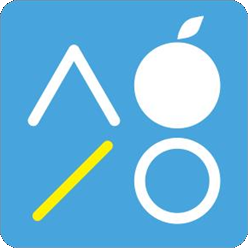

<p align="center"></p>

# SellBridge 설치파일

 **십이월마켓(어드민플러스) 회원사 판매자**를 위한 **위탁판매 자동화 프로그램**의 공식 배포처입니다.
스마트스토어 상품 등록 → 주문 자동 발주·예치금 결제 → 송장 회수 → 발송처리까지 자동으로 처리합니다.

> 이 저장소에는 설치파일만 있습니다. 소스 코드는 공개하지 않습니다.

## 다운로드

**[최신 버전 받기 → Releases](../../releases/latest)** 에서 `SellBridge_x.y.z_x64-setup.exe` 를 내려받으세요.

| 항목 | 내용 |
|---|---|
| 운영체제 | Windows 10 / 11 (64비트) |
| 요금제 | Basic 무료 — 스마트스토어 1개 연동 |
| 업데이트 | 설치 후에는 앱이 새 버전을 알려 줍니다(화면 위 "지금 업데이트") |

## 설치할 때 "Windows의 PC 보호" 창이 뜨면

아직 코드서명 인증서가 없어 처음 실행 시 SmartScreen 경고가 표시됩니다.
**추가 정보 → 실행** 을 누르면 설치됩니다. 설치파일은 아래 SHA-256 값으로 위·변조 여부를 확인할 수 있습니다(각 릴리스 설명에 기재).

```powershell
Get-FileHash .\SellBridge_0.1.4_x64-setup.exe -Algorithm SHA256
```

## 개인정보

- 판매채널 API 키·주문·배송지 정보는 **사용자 PC 에만** 저장되며 서버로 전송되지 않습니다.
- 서버에는 회원 이메일·구독·기기 정보만 저장됩니다.

## 약관

설치·가입 전에 확인하세요.

- [이용약관](https://license.infralog.kr/legal/terms)
- [개인정보처리방침](https://license.infralog.kr/legal/privacy)
- [소프트웨어 사용권 계약 및 저작권 고지](https://license.infralog.kr/legal/eula)

## 문의

이 저장소의 [Issues](../../issues) 에 남겨 주세요.

---

© 2026 해우소. All rights reserved. SellBridge 소프트웨어의 저작권은 해우소에 있습니다.
십이월마켓·어드민플러스·네이버·스마트스토어·쿠팡의 명칭과 로고는 각 권리자의 상표입니다.
